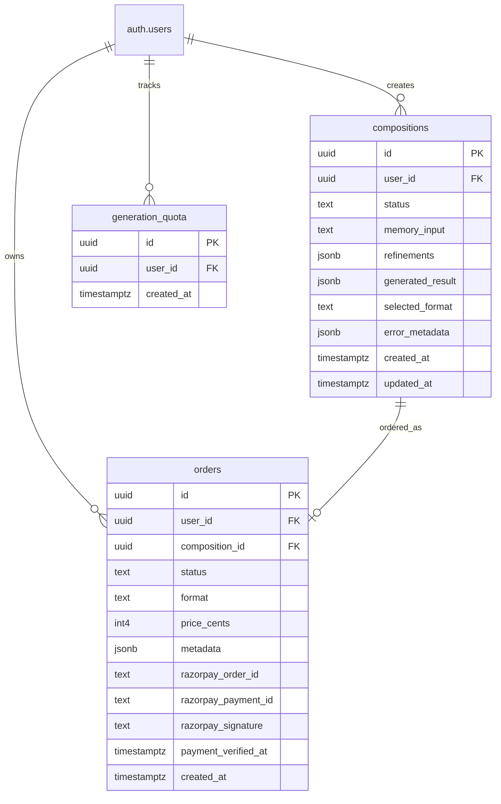

# Memoire - Scented Identity Project

Memoire is a production-ready, luxury-styled fragrance composition web application. Users capture sensory memories, refine mood metrics, generate AI-composed bespoke scent profiles, and execute verified format-based checkouts.

The platform is meticulously engineered for high availability, state resilience, and secure payment handling.

This project utilizes:
- **Frontend**: React 18 + Vite + TypeScript
- **Backend**: Supabase (Authentication, PostgreSQL + RLS, Deno Edge Functions)
- **Payment Engine**: Razorpay Native API (End-to-End Verified Checkout)
- **AI Engine**: Gemini 2.0 Flash for immersive fragrance generation

---

## Table of Contents

- [Product Capabilities](#product-capabilities)
- [Production Status & Hardening](#production-status--hardening)
- [Architecture](#architecture)
- [End-to-End User Flow](#end-to-end-user-flow)
- [Folder Structure](#folder-structure)
- [Environment Configuration](#environment-configuration)
- [Setup and Local Run](#setup-and-local-run)
- [Database Architecture & Relations](#database-architecture--relations)
- [Edge Functions API](#edge-functions-api)
- [Frontend Engineering](#frontend-engineering)
- [Static & Behavioral Testing](#static--behavioral-testing)
- [Deployment Pipeline (CI/CD)](#deployment-pipeline-cicd)

---

## Product Capabilities

Core product mechanics:
- **Narrative Homepage**: Premium styled landing with scroll-revealed brand philosophies.
- **Composition Wizard**: A 6-step immersive experience (`/create`) converting sensory descriptions to structured inputs.
- **State-Machine Generator**: Throttled, background-safe AI fragrance generation using Supabase and Google Gemini.
- **Secure Purchase Funnel**: Multi-format product selection dynamically localized in Indian Rupees (INR).
- **Live Dashboard**: Instant lookup of historical compositions, uniqueness certificates, and real-time delivery order summaries.

---

## Production Status & Hardening

The platform has undergone rigorous hardening to meet security standards:

*   **[v] Razorpay Native Integration**: Connected through a 3-way handshake: Order RPC Creation &rarr; Razorpay Order Token &rarr; Frontend checkout frame &rarr; Server-side HMAC-SHA256 validation.
*   **[v] State Recovery Job**: Embedded SQL cron/triggers automatically reset hung `processing` composition tasks back to `draft` after a 5-minute timeout.
*   **[v] Transaction Atomicity**: An isolated PostgreSQL RPC (`create_order_atomic`) enforces strictly unique order mutations using client-transmitted idempotency keys.
*   **[v] Rate Limiting Engine**: Edge functions restrict users to **10 generation tasks per hour** via custom `generation_quota` schemas.
*   **[v] Route Safeguards**: Implemented strict internal-path redirect allowlists and protected route component guards.

---

## Architecture

### Frontend Layer
- **Builder**: Vite 5 with aggressive, independently-cached manual chunks (`vendor-react`, `vendor-supabase`, `vendor-query`, `vendor-ui`).
- **State management**: Context-driven authentication alongside cache-optimized TanStack Query hooks.
- **Styling**: Tailwind CSS 3 + Radix UI primitives + curated typography + Sonner notifications.

### Backend Layer (Supabase)
- **Security**: Strict, object-level Row Level Security (RLS) enforcing isolated ownership.
- **Execution Engines**: Deno runtime serverless Edge functions configured with granular origin-safe CORS handlers.

### AI Engine Layer
- **Model**: `gemini-2.0-flash`
- **Mode**: Server-side secure HTTPS execution with automatic 2-pass structural parse fallback and linear backoff on Gemini timeouts.

---

## End-to-End User Flow

1. **Capture**: User inputs text memories and slider-based sensory configurations.
2. **Creation**: Draft persisted &rarr; user rate-limit verified &rarr; edge function invoked &rarr; Gemini builds notes profile.
3. **Presentation**: Component deserializes JSON composition properties into visual scent cards.
4. **Format Selection**: Choice between Luxury Perfume, Oils, Candles, or Diffusers using a single source of truth catalog.
5. **Authentication Gate**: Seamless, allowlist-safe OAuth/Email redirection preserving configuration state.
6. **Secured Checkout**: Payment initiated via Edge function, handled via native Razorpay window, verified server-side with HMAC hashing, and updated synchronously in PostgreSQL.
7. **Fulfillment View**: Finalized orders are recorded, locking in details for lookup in the `/dashboard`.

---

## Folder Structure

```text
scented-identity-project/
|-- .github/
|   `-- workflows/
|       `-- ci.yml                  # Automated validation pipeline
|
|-- public/
|   |-- logo-full.png
|   `-- favicon.png
|
|-- src/
|   |-- components/
|   |   |-- ProtectedRoute.tsx      # Route safeguard wrapper
|   |   |-- BrandLogo.tsx
|   |   |-- create/
|   |   |   |-- StepInput.tsx
|   |   |   |-- StepRefinement.tsx
|   |   |   |-- StepProcessing.tsx
|   |   |   |-- StepResults.tsx     # Aligned for single composition display
|   |   |   |-- StepDetail.tsx
|   |   |   `-- StepPurchase.tsx    # Razorpay-native UI element
|   |   `-- ui/                     # Modular shadcn primitives
|   |
|   |-- contexts/
|   |   `-- AuthContext.tsx
|   |
|   |-- hooks/
|   |   |-- useCompositionActions.ts # Remote API hook managers
|   |   `-- useCompositions.ts
|   |
|   |-- lib/
|   |   |-- pricing.ts              # Canonical INR pricing registry
|   |   |-- compositions.ts
|   |   `-- utils.ts
|   |
|   |-- pages/
|   |   |-- CreatePage.tsx          # Step engine + Resume error boundaries
|   |   |-- AuthPage.tsx            # Redirection safelisting core
|   |   `-- DashboardPage.tsx
|   |
|   |-- test/
|   |   |-- setup.ts
|   |   `-- auth.test.tsx           # Auth flows and ProtectedRoute assertions
|   |
|   `-- App.tsx                     # Routes + Consolidated Sonner systems
|
|-- supabase/
|   |-- config.toml
|   |-- migrations/
|   |   |-- 001_initial_schema.sql
|   |   |-- 002_add_failed_status_and_rpc.sql # Throttling, atomicity, recovery
|   |   `-- 003_razorpay.sql                  # Payment state persistence
|   `-- functions/
|       |-- generate-fragrance/
|       |-- create-order/
|       |-- initiate-payment/       # Dynamic Razorpay Order Token retrieval
|       `-- verify-payment/         # HMAC signature security validation
|
|-- vite.config.ts                  # Modular chunk configuration
`-- README.md
```

---

## Environment Configuration

### Frontend (.env)
```ini
VITE_SUPABASE_URL=https://mduapoxscchysvhlajaw.supabase.co
VITE_SUPABASE_PUBLISHABLE_KEY=<your-anon-key>
VITE_SUPABASE_PROJECT_ID=mduapoxscchysvhlajaw
```

### Edge Functions (Supabase Platform Secrets)
Set using the Supabase CLI via: `supabase secrets set KEY=VALUE`
```ini
GEMINI_API_KEY=AIzaSy...          # Secure Gemini model key
RAZORPAY_KEY_ID=rzp_live_...       # Live Payment API client identification
RAZORPAY_KEY_SECRET=...            # HMAC signing hash key
SUPABASE_URL=...
SUPABASE_SERVICE_ROLE_KEY=...
```

---

## Setup and Local Run

### Installation
```bash
npm install
```

### Run Local Server
```bash
npm run dev
```
Access local environment at `http://localhost:8080`.

### Build Verification
To perform a local optimal production compile:
```bash
npm run build
```

---

## Database Architecture & Relations

### Relationships (ERD Model)



### Row Level Security (RLS)
Enforced strictly across all custom tables. Authenticated user IDs (`auth.uid()`) are verified against `user_id` attributes on all operations, ensuring cross-tenant data isolation.

---

## Edge Functions API

Edge Functions run on Deno and support cross-origin requests from the standard Vercel and localhost environments.

### `generate-fragrance`
- **Endpoint**: `POST /functions/v1/generate-fragrance`
- **Input**: `{ composition_id }`
- **Logic**: Reads user memory, throttles based on `generation_quota`, queries Gemini, updates state.
- **Recovery**: Terminal errors revert status to `draft` and persist metadata into `error_metadata`.

### `create-order`
- **Endpoint**: `POST /functions/v1/create-order`
- **Input**: `{ composition_id, format, idempotency_key }`
- **Logic**: Executes atomic SQL transaction creating records, assigning formatted INR rates, and marking locked flags.

### `initiate-payment`
- **Endpoint**: `POST /functions/v1/initiate-payment`
- **Input**: `{ order_id }`
- **Logic**: Looks up order metadata, invokes Razorpay Orders REST Endpoint, returns `razorpay_order_id` tokens back to UI.

### `verify-payment`
- **Endpoint**: `POST /functions/v1/verify-payment`
- **Input**: `{ order_id, razorpay_order_id, razorpay_payment_id, razorpay_signature }`
- **Logic**: Builds standard HMAC-SHA256 signatures verifying authentic web-origin and transitions orders to `confirmed`.

---

## Frontend Engineering

*   **Consolidated Catalog**: The `src/lib/pricing.ts` utility provides standard models for `Eau de Parfum`, `Parfum Extrait`, `Fragrance Oil`, `Scented Candle`, and `Reed Diffuser`.
*   **Payment Loader Hook**: Handled by a reactive document-injected element wrapper (`useRazorpay`) loading only when mounting the checkout view.
*   **Resilience Engineering**: Added React boundary UI handling dynamic loading issues during the hydrated resume flow configurations.

---

## Static & Behavioral Testing

*   **Linter**: Optimized configurations with zero active TS errors. (`npm run lint`).
*   **Testing Library**: Implemented Vitest assertions with mock-hoisted navigations ensuring component safety.
*   **Execution**: `npm run test`

---

## Deployment Pipeline (CI/CD)

Automatically validated by GitHub Actions on each merge/pull request into main branches.
The workflow covers:
1.  Fresh standard dependency installs.
2.  Full project linter verification.
3.  Vitest unit regression suites execution.
4.  Optimal production asset bundling and tree-shaking.
